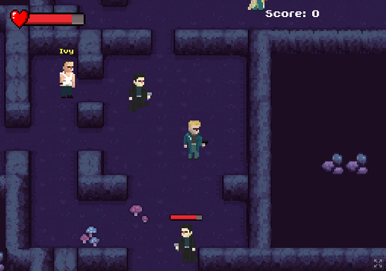

# Ludum dare 57 submission - <i>Dream depths</i>

2-D shooter with Inception-like dream-entering mechanic developed with <a href="https://godotengine.org/">Godot engine</a>.

  

### Game description:
Interact with NPCs to enter their dreams in order to find <i>The Chosen One</i>. Defeat enemy agents trying to stop you.

Red NPCs have infinitely deep dreams. Yellow NPCs are side quests - they don't have infinite depth. If you find the blue one, you win! You can leave the current dream by finding the ladder which will return you to the previous dream (level).

Increase your health by collecting health potions. Increase your score by entering dreams, defeating enemies and collecting coins. Get as high score as possible!

### Controls:
* [WASD/Arrows] = Move
* [Mouse] = Shoot
* [E] = Interact
* [Q] = Quit

Game can be played <a href="https://rangoiv.itch.io/dream-depths">here</a>. Good luck!